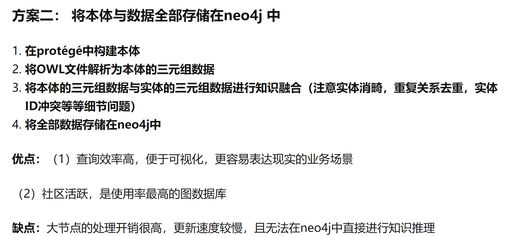

思路：
    1.构建Ontology本体
    2.爬取wiki的数据
    3.爬取的数据转化为csv文件
    4.将csv文件转化为

知识图谱存储及本体映射方法:
https://zhuanlan.zhihu.com/p/80274974
（主要看方案二）

1.直接用Neo4j构建知识图谱，和用本体构建知识图谱之后再用Neo4j做可视化存储，具体是什么区别？
    需要做一个课程的知识图谱，看到有些文章是先用本体法构建好知识图谱，然后再利用Neo4j做可视化存储；而有些文章是直接利用Neo4j构建知识图谱。 
https://www.zhihu.com/question/445819954/answer/1744665397

2.做问答系统, 使用neo4j建立知识图谱, 如何将自然语言Question转换成为cypher查询?
做问答系统, 使用neo4j建立知识图谱, 如何将自然语言Question转换成为cypher查询? 命名实体识别?
https://www.zhihu.com/question/315084236/answer/729785888

